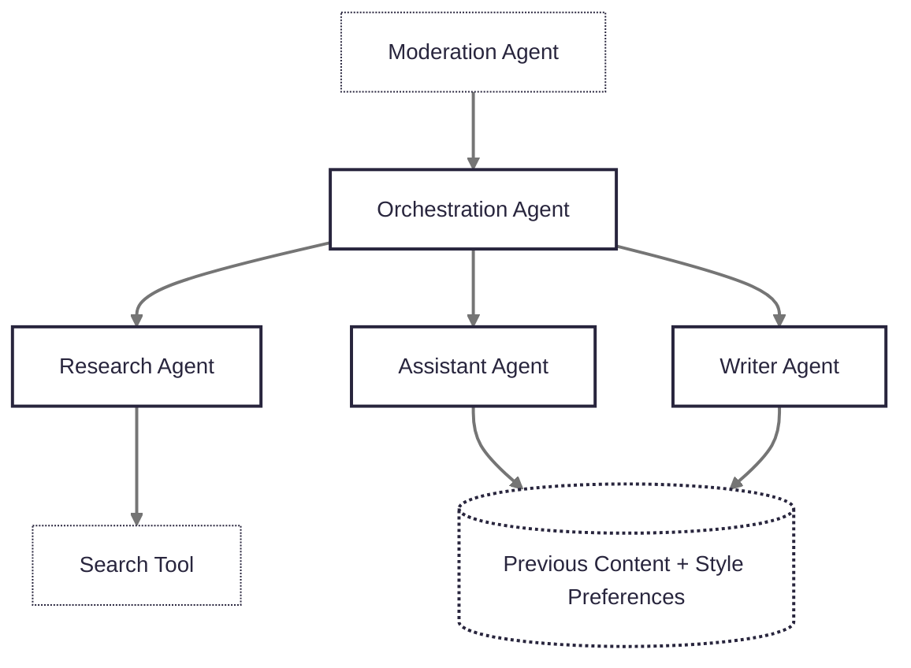

# Inksink

InkSink is a kitchen sink for writing content. An AI assistant that gives you lots of handy tools to help you write content.


## Getting Started

1. Install dependencies:

   ```bash
   yarn install
   ```

2. Set up environment variables

   ```bash
   cp .env.example .env
   ```

3. Setup Sentry https://docs.sentry.io/platforms/javascript/guides/nextjs/

4. Setup PostHog https://posthog.com/docs/libraries/next-js

5. Run the development server:

   ```bash
   yarn dev
   ```

6. For the mastra development server:

   ```bash
   yarn mastra
   ```

## AI Assistant Workflow


