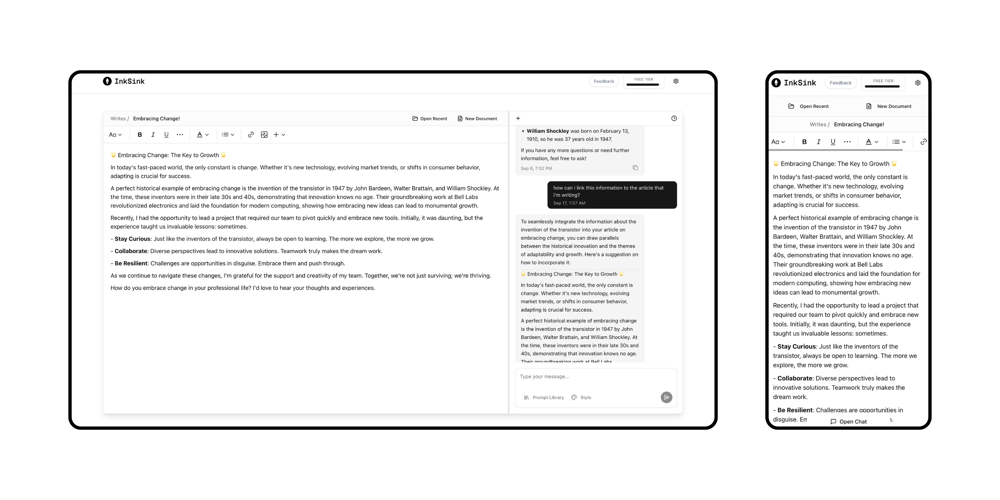

# Inksink

InkSink is a kitchen sink for writing content. An AI assistant that gives you lots of handy tools to help you write content.



## Getting Started

1. Install dependencies:

   ```bash
   yarn install
   ```

2. Set up environment variables
3. Run the development server:

   ```bash
   yarn dev
   ```

4. Open [http://localhost:3000](http://localhost:3000) in your browser

## Tech Stack

- Next.js 14
- TypeScript
- Tailwind CSS
- TipTap Editor
- Supabase
- Mastra
